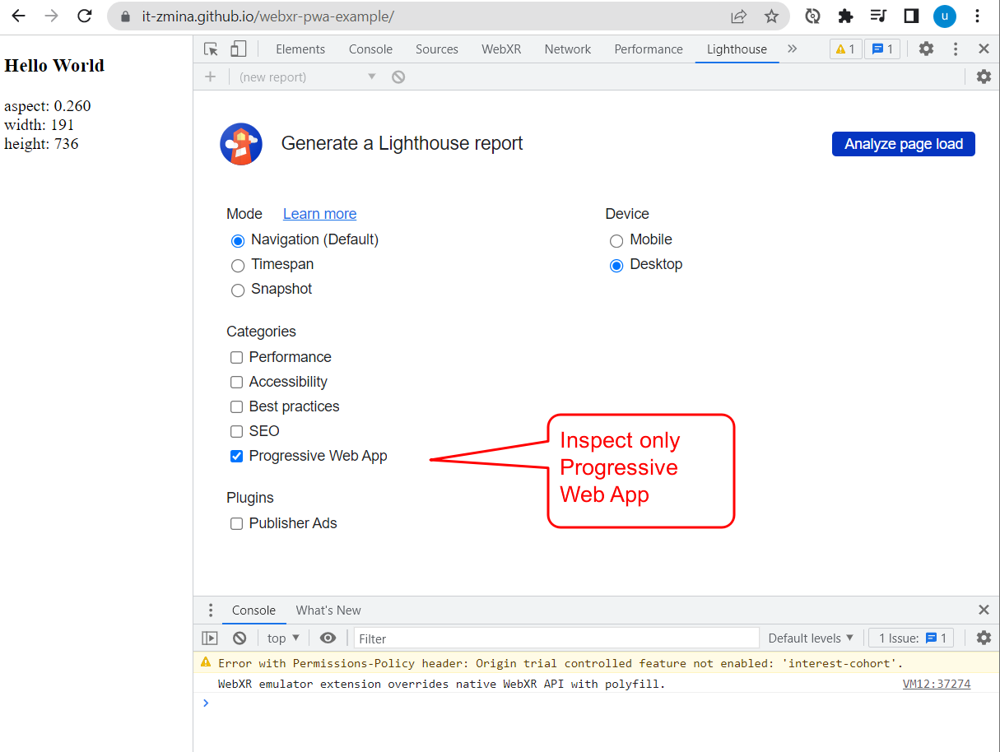
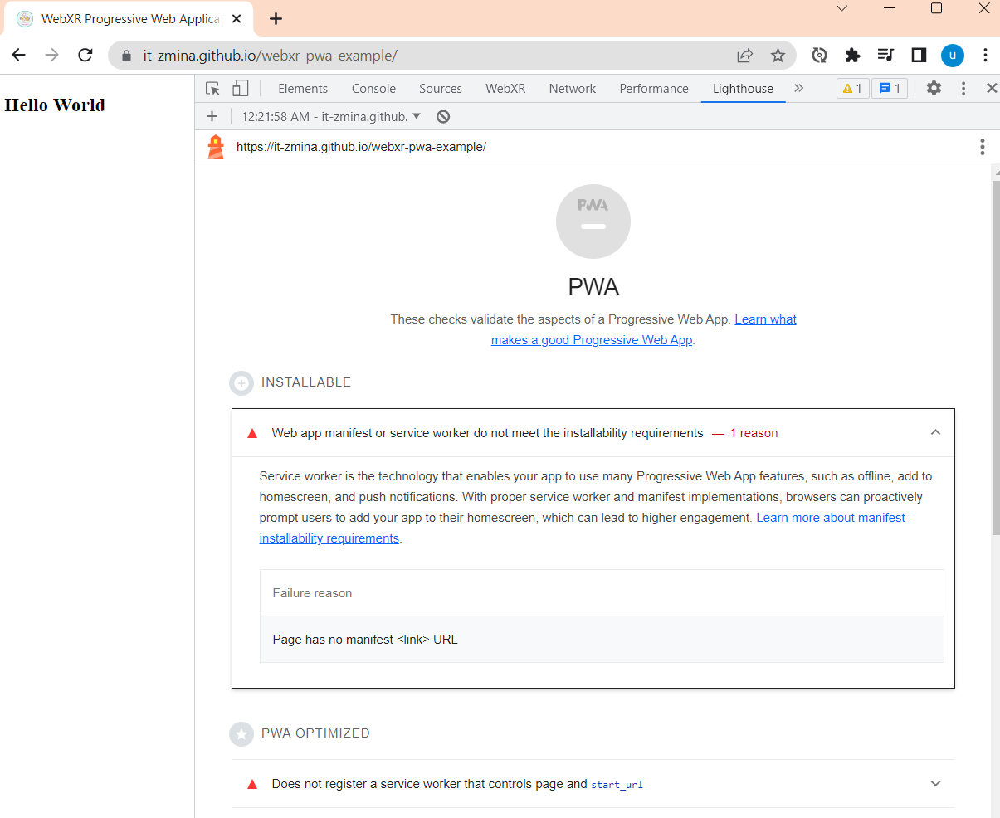
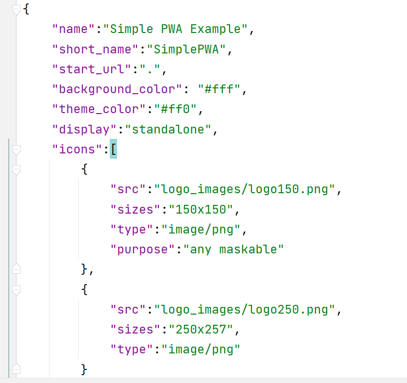
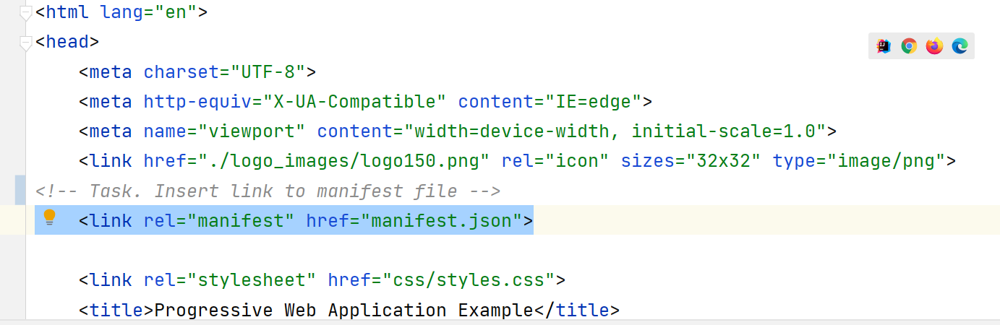
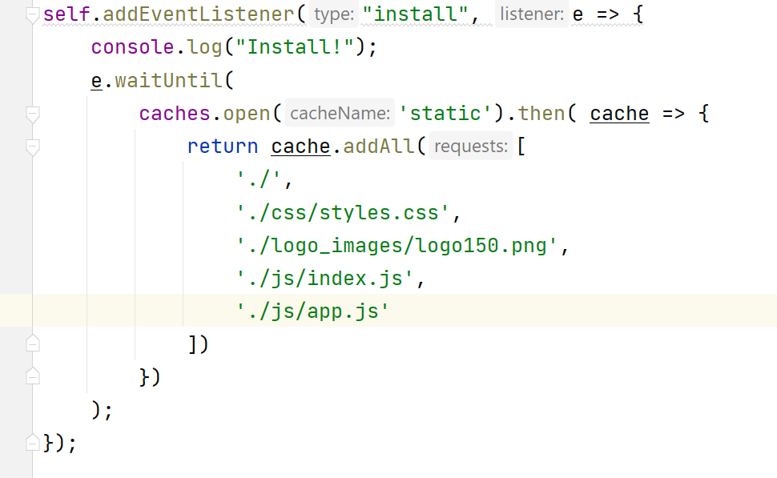
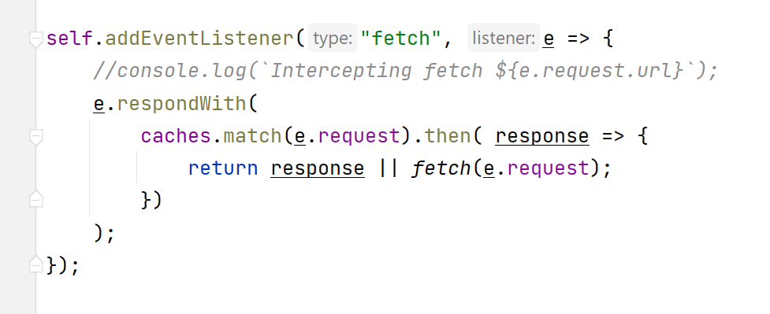
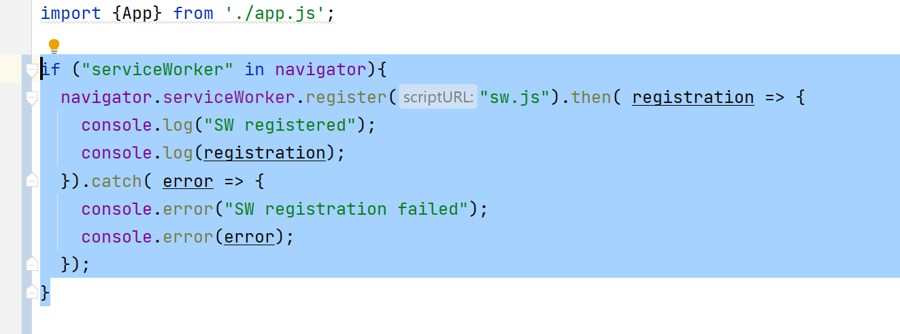
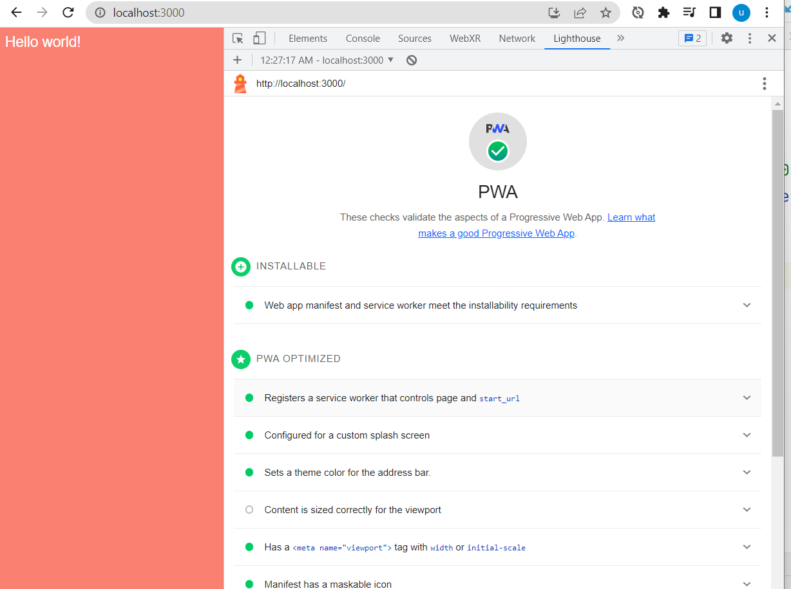
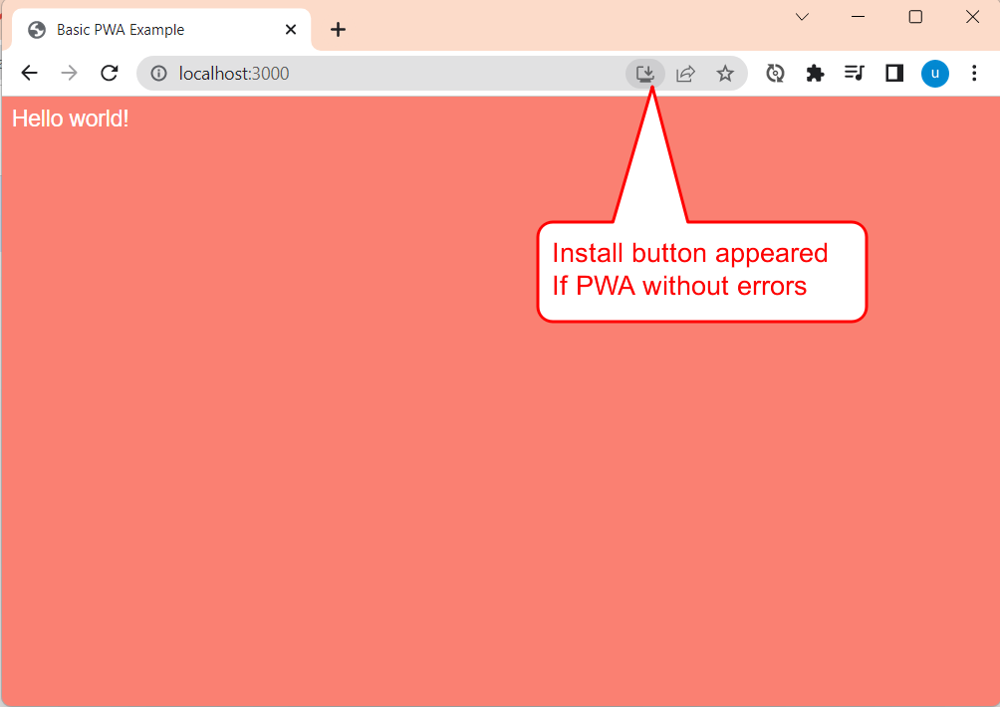

# WebXR Progressive Web Application Example

## Configure Progressive Web Application (PWA)

Start Lighthouse diagnostic for PWA 


Check audit results


Add manifest


Register manifest


Add service worker




Register service worker


Check audit again


Install web page as native application



## Link to the site page
GitHub user page format
```
http://<username>.github.io/<repository>
```
http://it-zmina.github.io/webxr-pwa-example


## Resources


[Lighthouse Documentation](https://developer.chrome.com/docs/lighthouse/overview/)

Models:
- https://kenney.nl/assets?q=3d
- https://quaternius.com
- https://www.cgtrader.com/
- https://www.turbosquid.com/
- https://free3d.com/3d-models/
- https://www.mixamo.com/

Audio:
- https://mixkit.co/free-sound-effects/game/
- https://elements.envato.com/sound-effects

### Github repository with useful links

[https://github.com/it-zmina/vr-info/blob/main/WEB-VR.md](https://github.com/it-zmina/vr-info/blob/main/WEB-VR.md)

## Working with submodules

Add submodule

```aidl

```

Remove submosule
```aidl
# Remove the submodule entry from .git/config
git submodule deinit -f path/to/submodule

# Remove the submodule directory from the superproject's .git/modules directory
rm -rf .git/modules/path/to/submodule

# Remove the entry in .gitmodules and remove the submodule directory located at path/to/submodule
git rm -f path/to/submodule
```